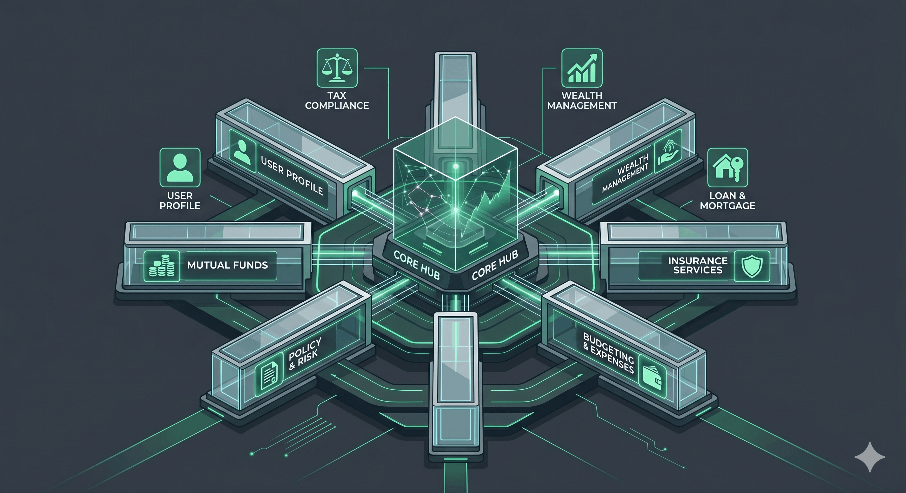
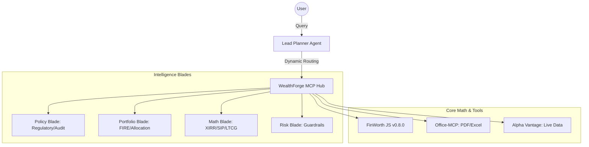

# WealthForge AI



**WealthForge AI** is a technical framework for building an **agentic personal finance workforce**. It orchestrates multi-agent systems using the **Model Context Protocol (MCP)**, tailored for the Indian financial landscape (FY 2025-26).

[**🌐 Live Presentation Site**](https://vikisingh23.github.io/wealth-forge-ai/)

> **⚠️ DISCLOSURE**: This project is for **educational and research purposes only**. It is not a financial advisory service. Always verify with a registered CA or CFP.

---

## 🏛️ System Architecture

WealthForge AI utilizes a **"Hub & Blade"** orchestration model with deterministic math.



---

## 💎 Key Capabilities

- **CAS Statement Parsing**: Reads CAMS/KFintech/MFCentral PDFs, extracts holdings, calculates XIRR
- **LTCG Tax Harvesting**: Auto-generates month-by-month exit plans within ₹1.25L exemption
- **Portfolio Overlap Detection**: Flags >70% overlap, concentration risk, underperformers
- **Financial Health Scorecard**: 0-100 score across 6 dimensions with priority actions
- **Labour Code 2025 Compliance**: Salary breakup (basic ≥50%), ESI, fixed-term gratuity
- **FY 2025-26 Tax Engine**: New regime slabs, ₹12.75L zero-tax threshold, full deductions reference
- **SIP Restructuring**: Date spreading, step-up projections, category completeness
- **Direct vs Regular Audit**: 10-year cost projection for Regular plan holders
- **Deterministic Math**: All calculations via [finworth-js](https://github.com/vikisingh23/finworth-js) — zero LLM hallucination on numbers

---

## 👥 The Agentic Workforce

| Agent | Role |
|-------|------|
| **Lead Planner** | Synthesizes multi-agent data into a cohesive roadmap |
| **Tax Strategist** | FY 2025-26 slabs, Old vs New regime, Labour Code, complete deductions reference |
| **MF Specialist** | CAS parsing, overlap, LTCG harvesting, SIP restructuring, Direct/Regular audit |
| **Financial Health Scorecard** | 0-100 scoring across Emergency Fund, Debt, Insurance, Investments, Tax, Goals |
| **Loan Specialist** | RLLR vs MCLR, balance transfer math, prepayment vs invest analysis |
| **Policy Analyst** | Insurance audit (LIC/ULIP/GWP), IRR calculation, surrender analysis |
| **Budget Agent** | Cashflow analysis, 50/30/20 rule, emergency fund planning |
| **Intake Specialist** | 25-question, 7-phase structured financial data collection |
| **Stress Tester** | Black swan simulation, sequence-of-return risk, resilience scoring |
| **Policy Scout** | RBI/SEBI/Budget regulatory monitoring |

---

## 🛠️ Tech Stack

- **Framework**: Model Context Protocol (MCP)
- **Hub**: `mcp/hub.mjs` — Dynamic tool routing with 4 blades (Policy, Portfolio, Math, Risk)
- **Math Engine**: [finworth-js v0.8.0](https://github.com/vikisingh23/finworth-js) — 22+ financial calculators
- **Python Engine**: [finworth v0.8.0](https://github.com/vikisingh23/finworth) — Same calculators for Python workflows
- **Cross-IDE**: `.cursorrules`, `.kirorules`, `CLAUDE.md`, `.gemini/` — works everywhere
- **Setup**: `npm run setup` — one-command initialization

---

## 🚀 Quick Start

```bash
git clone https://github.com/vikisingh23/wealth-forge-ai.git
cd wealth-forge-ai
npm run setup
```

Open in **Cursor**, **Kiro CLI**, or **Claude Code**. The framework auto-injects the WealthForge persona.

### Example
> *"I am 25, Bangalore, ₹18L CTC. Parse my CAS, run overlap analysis, and suggest SIP allocation for FIRE by 45."*
>
> *"I am 35, Mumbai, ₹42L CTC. Generate LTCG harvesting plan for this FY and score my financial health."*
>
> *"I am 45, Delhi, ₹75L CTC. Build a retirement roadmap — how much more do I need to save monthly?"*

---

## 📈 Workflows

See [WORKFLOWS.md](./docs/WORKFLOWS.md) for detailed walkthroughs:
- Tax Regime Battle (Old vs New with breakeven)
- FIRE Roadmap (corpus + SIP + milestones)
- Insurance Forensic (IRR audit)
- Portfolio Cleanup (overlap → consolidation → exit calendar)

## 🛡️ Security
- **Local-First**: FinWorth engine runs on-device
- **PII Masking**: Prompt-level rules prevent PAN/Aadhaar transmission
- **Risk Guardrails**: Hard-coded policies (max equity = 100 - age, emergency fund checks)

## 📄 License
MIT License. Created by [Vikas Singh](https://github.com/vikisingh23).
